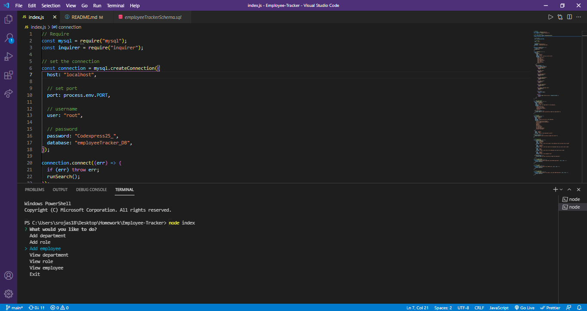
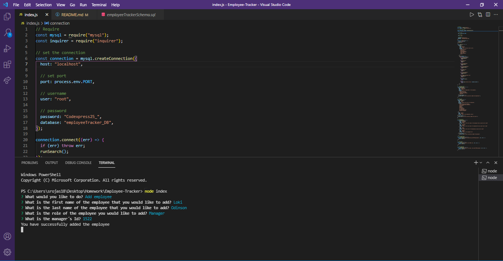

# Employee-Tracker

## Table of contents
  * [Description](#Description)
  * [Technologies](#Technologies)
  * [Installation](#Installation)
  * [Usage](#Usage)
  * [Contributing](#Contributing)
  * [Test](#Test)
  * [Questions](#Questions)
  * [Credits](#Credits)
  * [License](#License)

  ## Description
 The following project allows an HR manager to be able to view information about employees, roles and departments of the company. It also allows to add a new employee to the database. 

  ##  Technologies
  * node.js
  * Javascript
  * MySQL
  * inquirer

  ## Installation
  * Create a repo on GitHub
  * Clone the repo into your desire folder
  * Create an index.js file
  * Create a .gitignore to save the node_modules
  * Open the integrated terminal and install a package json
  * Run npm init, npm install, npm install require, npm install mysql
  * Create the functions that would display the choices for the HR manager
  * Run into the integrated terminal by using the command node index.js
  * Answer all the information
  * Commit changes

  ## Usage
  It is useful for an HR member to control and have all the information about the employess of a company. 

  ## Test
  Link to the demo: https://drive.google.com/file/d/1YA7LBwqmucnlJii5uf6xPY6rOy1jE2jU/view
  https://drive.google.com/file/d/1_3x22V6eC4-1N_nDEYXm9U51vjmGvUY2/view
  
  
  

  ## Questions
  For further questions please contact the author

  ## Credits
  Sofia Rojas sofiacrf@github.com

  ## Link to github repo
  https://github.com/Sofiacrf/Employee-Tracker.git
  